# 多样性
## 物品相似性的度量

- 基于物品的属性标签（离散标签，较为简单）

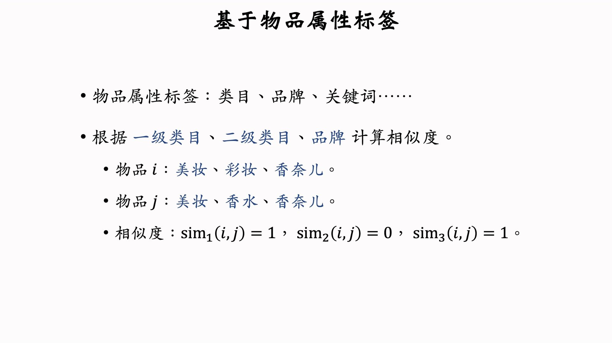

- 基于物品的向量表征（嵌入向量，需要学习。召回的双塔模型中学到的物品向量不适用于这个地方的相似性计算，这是由于推荐系统中**长尾效应**比较明显，召回过程中对这些样本的嵌入向量学习效果不好。最好还是基于内容，也就是图片+语言模型提取特征）

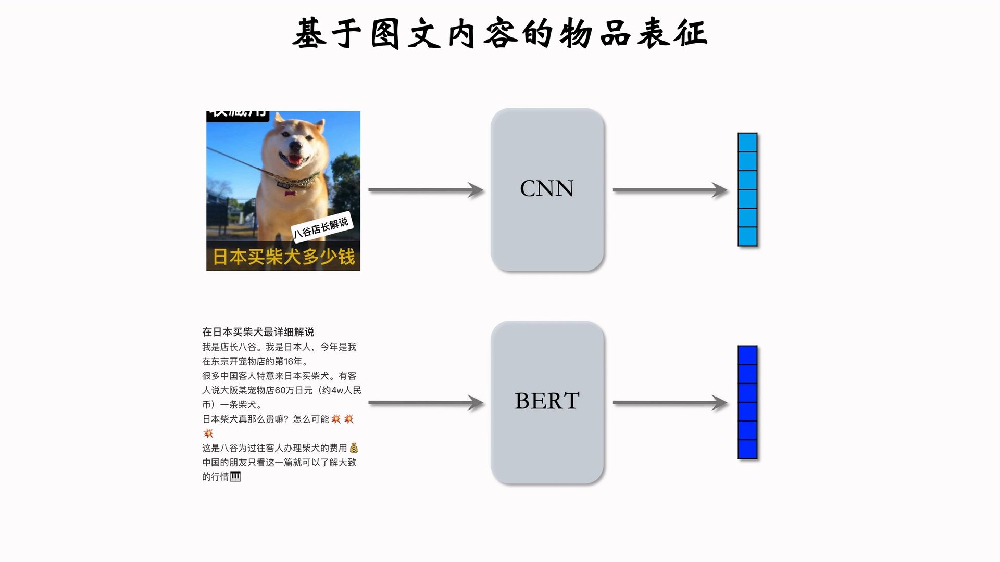

> 问题：如何训练这些特征提取模型？==> 使用**CLIP模型**，这个很适合小红书的场景、图文相关
## 提升多样性的方法

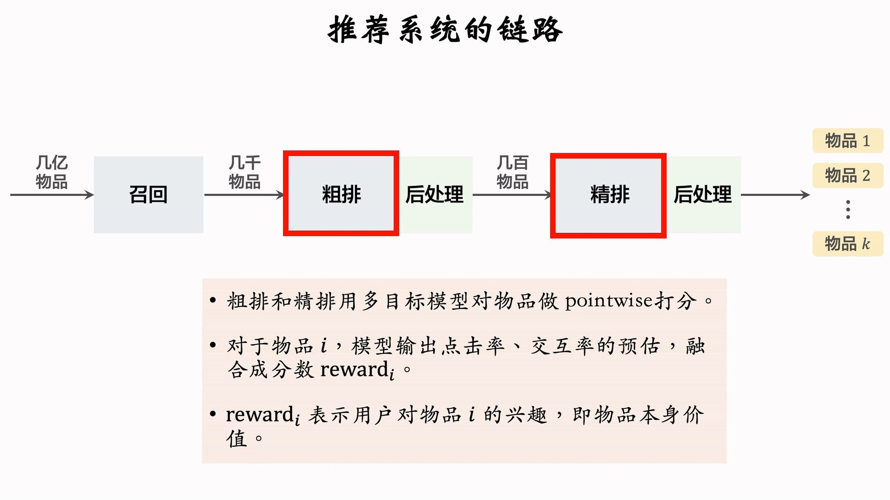
排序模型就是给物品打分，给出reward分数。我们在后处理中提高多样性，在n个候选品中选出k个多样化的物品。
精排后的后处理也叫**重排**，当然粗排后进行多样化后处理也是有效果的。
## 重排的规则
为了业务需求，在重排的时候需要一些特定的规则约束。如：

- **最多连续k次出现某类笔记**：例如小红书最多连续出现k=5篇图文笔记，最多连续出现k=5篇视频笔记
- **k个连续笔记最多出现一个某类笔记**：例如广告不能太多（？），每k=9条笔记最多一条
- **前t篇笔记最多出现k篇某类笔记**：例如开屏第一次推送，不能太多广告（？）

## MMR方法
> [Maximal Marginal Relevance](https://www.cs.cmu.edu/~jgc/publication/The_Use_MMR_Diversity_Based_LTMIR_1998.pdf)，该方法来自搜索排序

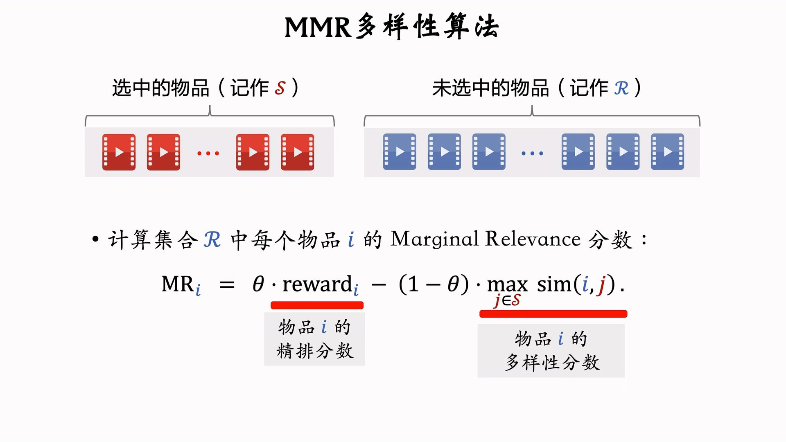
MMR就是每次把MR分数最高的物品加入S集合。如果S集合很大（已经包含了非常多样化的物品），那么MMR算法会趋于失效：

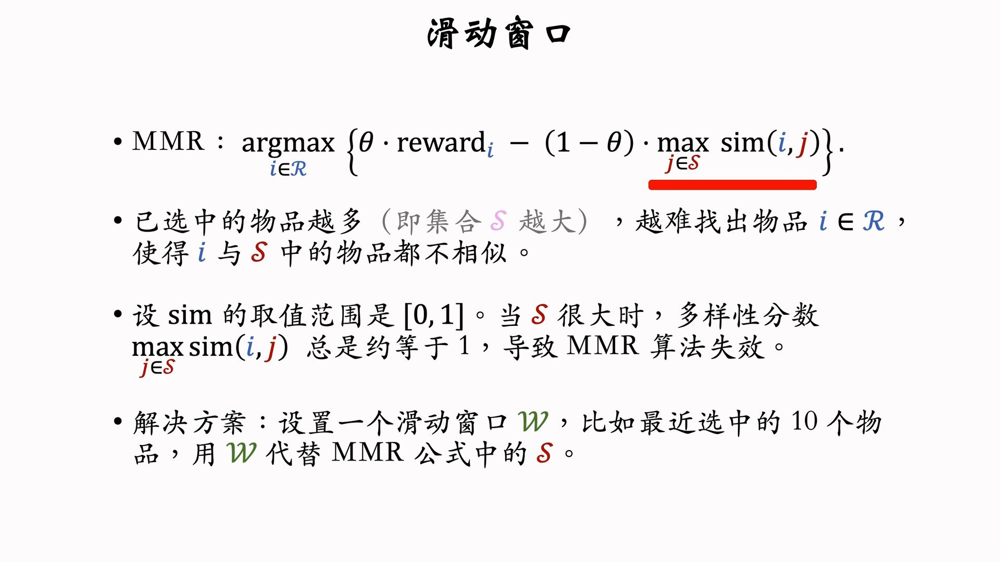
使用滑动窗口其实就是只考虑LastN的相似度（其实用户看的时候也只会记住几个物品，不需要整个序列都不相似）：

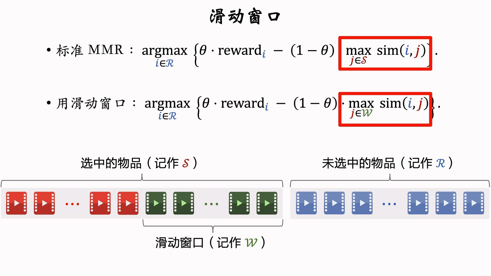
## DPP算法
> [Determinant Point Process](https://arxiv.org/abs/1709.05135)，行列式点过程

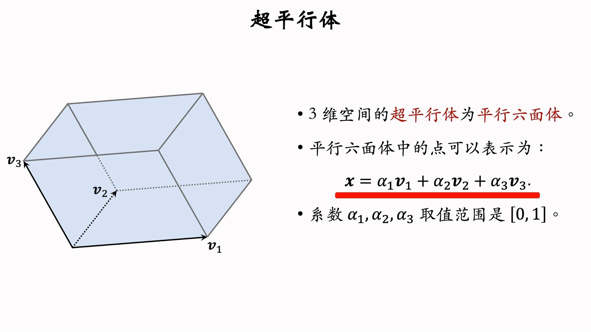
我们就用超平行体的体积来衡量物品多样性：

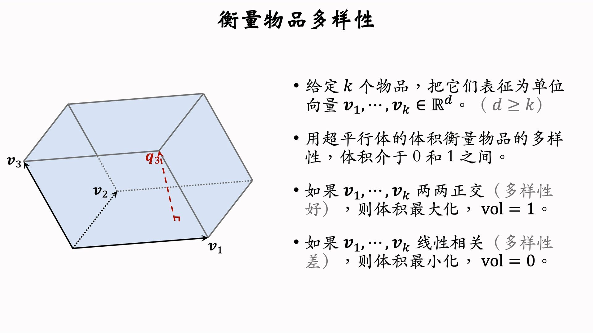

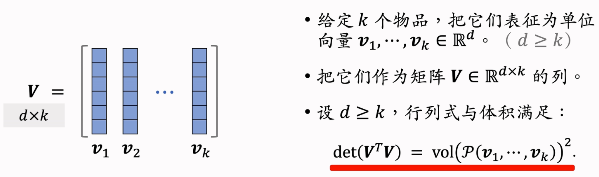
所以本质上就是考虑行列式：

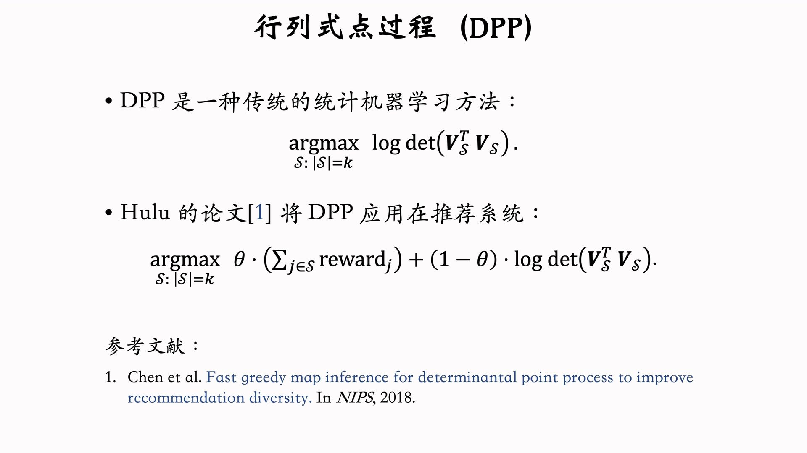
Hulu主要的贡献是给出了该过程的高效算法：

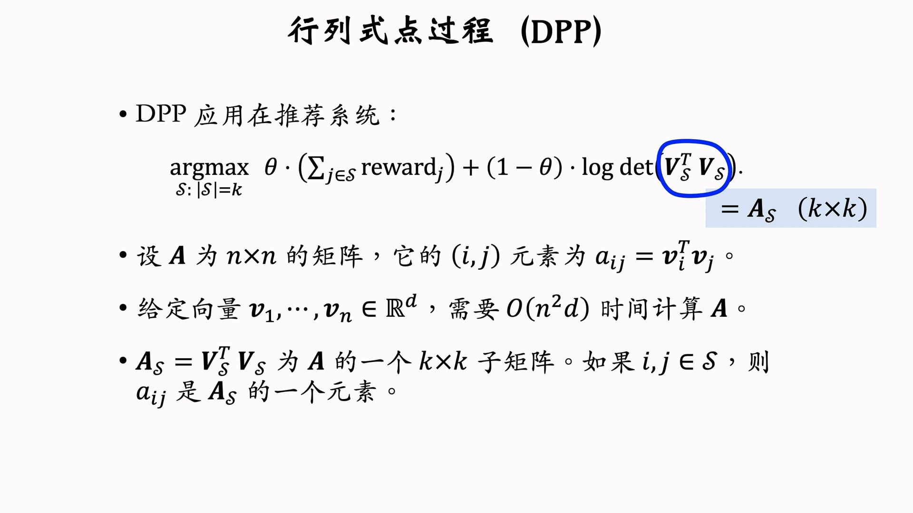
使用贪心算法求解：

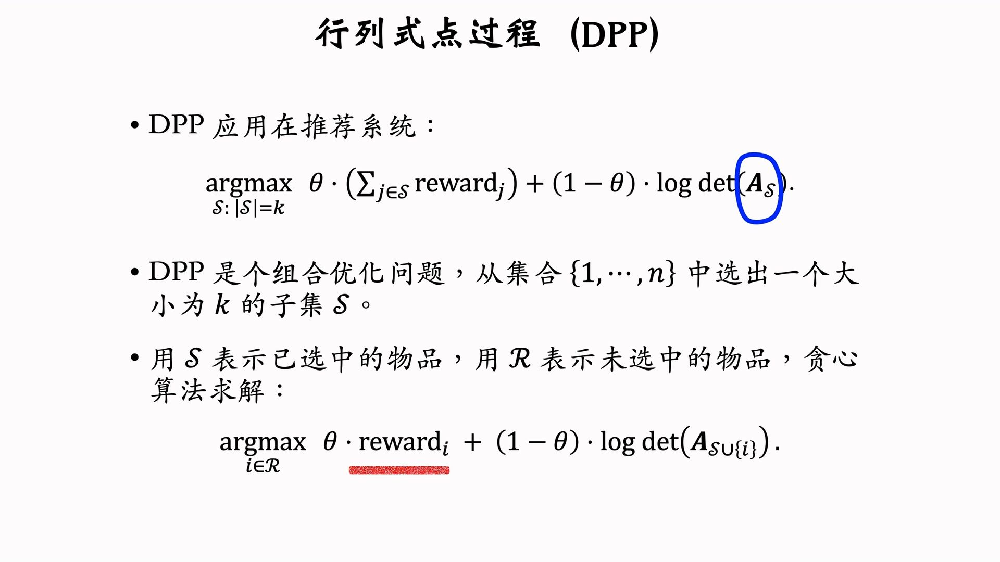

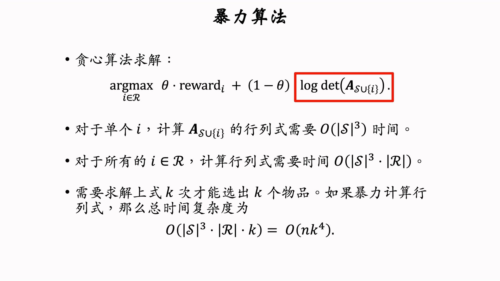

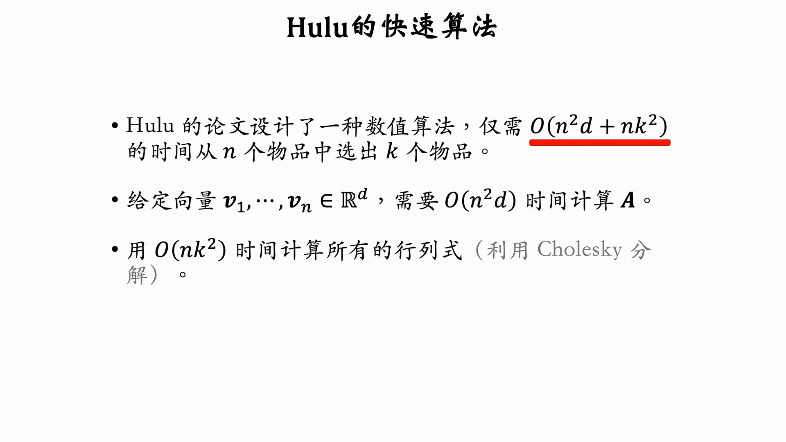
给矩阵添加一行和一列之后，直接考虑Cholesky分解的变化：

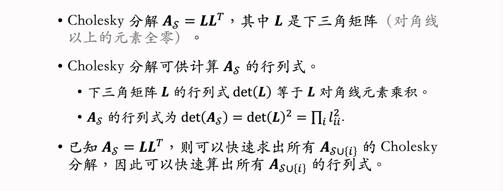
DPP算法也有可能失效（物品已经非常多样化，趋于线性相关～），需要使用滑动窗口来进行优化：

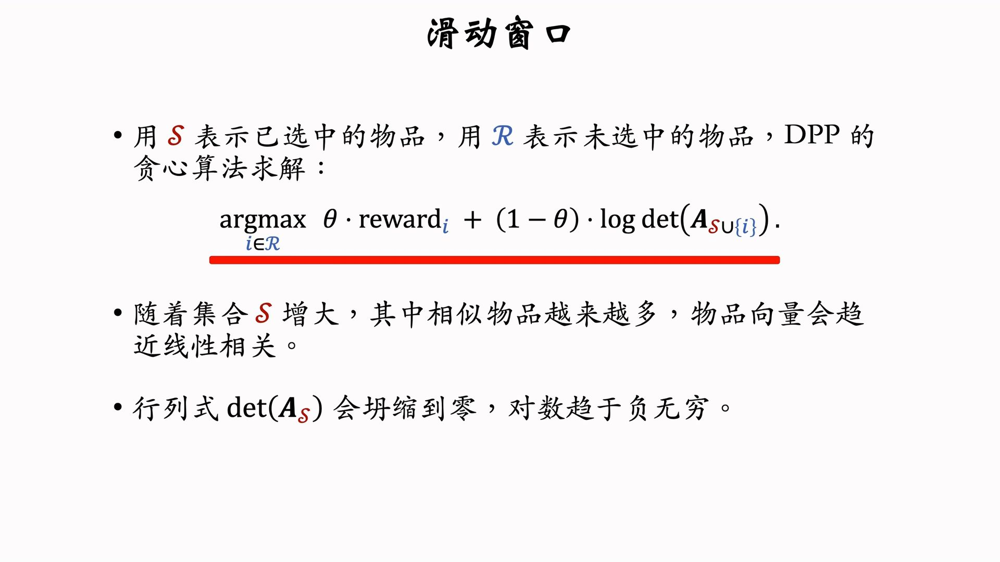
