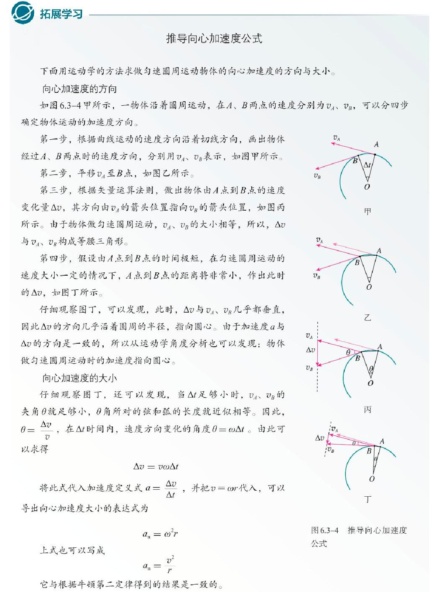
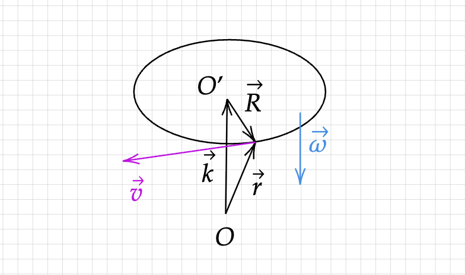
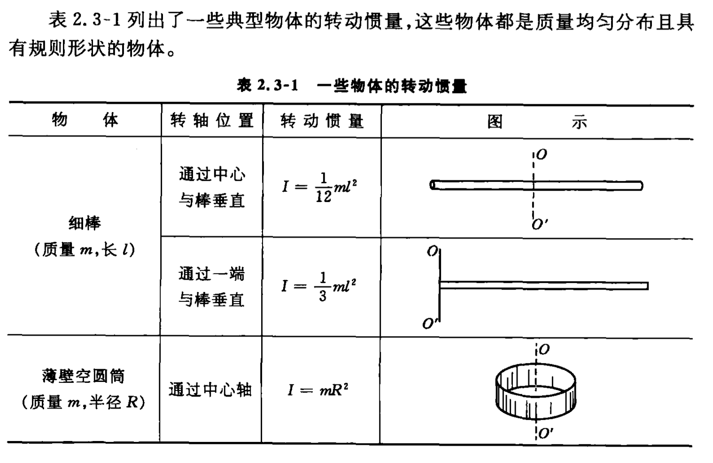

---
tags:
- Calculus
- Algebra
include:
- math
---
# 牛顿力学

牛顿力学是高中物理的主要内容，然而由于数学工具的缺失，高中的物理充满了各种黑魔法。最近看了看大学的物理课本，重新认识了一下牛顿力学～

## 运动学

没有微积分，运动学就到处充满了黑魔法。有了微积分，运动学无非就是求导求导再求导，积分积分再积分。

### 匀速圆周运动

众所周知，匀速圆周运动的加速度公式是：
$$
a = \frac{mv^2}{R}
$$

那么它到底是如何计算出来的呢？

高中物理书本上会给出一种直观的推导过程，使用极限的思想、直接用加速度的定义来求。其中有很多近似操作，高中的我也搞不懂到底能不能这么近似：

实际上我们可以**使用微积分给出更加简单的计算过程**。

根据匀速圆周运动的定义，质点的位置在半径为$R$的圆周上以恒定角速度$\omega$变化，它的位矢是：

$$
\vec{r} = (R\cos(\omega t), R\sin(\omega t))
$$

??? question "矢量求导"
    根据运动的合成与分解原则，我们可以对横纵坐标分别求导（也就是把运动分解为水平和竖直方向）。

对时间求导就得到速度：

> 不难发现，这是一个始终和位矢垂直的向量！

$$
\vec{v} = \frac{d \vec{r}}{dt}= (-\omega R\sin(\omega t), \omega R\cos(\omega t))
$$

它的模就是速度大小：

$$
|\vec{v}| =  \omega R
$$

再次求导就得到加速度：

> 不难发现，这是一个始终指向圆心的矢量。因为匀速圆周运动只有向心加速度。

$$
\vec{a} = \frac{d \vec{v}}{dt} = (-\omega^2 R\cos(\omega t), -\omega^2 R\sin(\omega t))
$$

它的模就是加速度大小：
$$
|\vec{a}| =  \omega^2 R
$$

### 斜抛运动

我们再看一个简单的曲线运动：抛体运动。

设质点以$\theta$的角度、$v_0$的初速度向上斜抛，那么在运动过程中位矢为：

$$
\vec{r} = (v_0\cos\theta \cdot t, v_0\sin\theta \cdot t-\frac{1}{2}gt^2)
$$

它的计算比较简单，按照高中的做法只需要把运动分解为水平匀速运动、竖直方向加速运动即可。

我们也可以**使用微积分反向求解**：

首先我们知道质点只受向下的重力，所以加速度是：

> 我们以抛点为原点，建立直角坐标系。上为竖直正方向、右为水平正方向～

$$
\vec{a} = (0, -g)
$$

??? question "矢量积分"
    根据运动的合成与分解原则，我们可以对横纵坐标分别积分（也就是把运动分解为水平和竖直方向）。

积分得到速度：

$$
\begin{aligned}
&\vec{v}\\\\
=& \vec{v_0} + \int_{0}^t \vec{a}dt \\\\
=& (v_0\cos\theta, v_0\sin\theta) + (0, -gt)\\\\
=& (v_0\cos\theta, v_0\sin\theta -gt)\\\\
\end{aligned}
$$

再次积分即可得到位矢：

$$
\vec{r} = \vec{r_0} + \int_{0}^t \vec{a}dt = (0,0) + (v_0\cos\theta \cdot t, v_0\sin\theta -\frac{1}{2}gt^2)
$$

通过圆周运动和抛体运动，读者应该可以感受到向量微积分的魅力。

## 动量与角动量

动量和角动量完全描述了刚体的运动。由于对向量**外积**相关数学知识的缺失，高中物理并未涉及刚体的转动。

### 动量定理

根据牛顿定律，我们知道：

$$
\vec{F} = m\vec{a} = m\frac{d\vec{v}}{dt}
$$

所以
$$
\vec{F} = \frac{d(m\vec{v})}{dt}
$$

从中我们提取出动量的定义：
$$
\vec{p} = m\vec{v}
$$

此外我们力在时间上的积累为冲量：
$$
\vec{I} = \int_{t_0}^t \vec{F}dt
$$

为什么要定义这些东西呢？因为我们有动量定理：

$$
\Delta\vec{p} = \vec{p} - \vec{p_0} = \vec{I}
$$

也就是系统的动量变化等于外力施加的冲量。换言之，如果系统不受到外力，动量应该守恒。

### 角动量定理

类似的，针对刚体的转动，我们有角动量定理。

在惯性参考系中，物体相对于某个原点的角动量定义为：

$$
\vec{L} = \vec{r} \times \vec{p}
$$

> 其中$\vec{r}$是原点指向质点的位矢

根据外积的定义，它的模为：
$$
|\vec{L}| = |\vec{r}||\vec{p}|\sin\phi
$$

方向由右手螺旋定则确认。

<figure markdown>

<figurecaption>质点转动示意图</figurecaption>
</figure>

利用圆周运动中线速度和角速度的关系：

$$
\vec{v} = \vec{\omega} \times \vec{R}
$$

> 其中$\vec{R}$是质点到转轴的距离

我们得到：
$$
\vec{L} = \vec{r} \times m\vec{v} = m\vec{r} \times \vec{\omega} \times \vec{R}
$$

这是一个[向量三重积](https://zh.wikipedia.org/zh-cn/%E4%B8%89%E9%87%8D%E7%A7%AF#%E5%90%91%E9%87%8F%E4%B8%89%E9%87%8D%E7%A7%AF)，展开得到：
$$
\vec{L} = m \left[ (\vec{r}\cdot\vec{R}) \vec{\omega} - (\vec{r}\cdot\vec{\omega})\vec{R} \right]
$$

显然，他有两个分量，分别是转轴上的：

$$
\vec{L_x} = m(\vec{r}\cdot\vec{R}) \vec{\omega} = {\color{red}mR^2}\vec{\omega}
$$

以及垂直转轴的另外一个分量（暂时不管）。

可以看到，角动量出现了和动量表达式中**质量**相似的常系数，我们把它称为**转动惯量**：

$$
I = mR^2（质点） = \sum R_i^2m_i（质点系）
$$

最终我们得到了转动惯量的简洁表达式：

$$
\vec{L} = I\vec{\omega}
$$

??? question "转动惯量的计算"
    转动惯量与刚体的形状、质量分布、转轴的位置有关。

    

    常见物体的转动惯量如上，利用平行轴定理等结论可以快速得到更多情形的转动惯量。

为了衡量力对刚体转动的影响，我们定义一个新的物理量，力矩：

$$
\vec{M} = \vec{r}\times \vec{F}
$$

类似动量定理，我们有角动量定理：

$$
\Delta \vec{L} = \vec{L_t}-\vec{L_{t_0}} = \int^t_{t_0} \vec{M}dt
$$

这同样说明，在无外力施加力矩的情况下，角动量守恒。

### 边飞边转

有了上述知识我们就可以处理一个非常简单的问题了，你在桌子上放一只笔，然后用手指弹一下三等分点的位置，那么笔应该会**边往前飞边旋转**！

提炼为理想模型就是：长度为$\ell$、质量为$m$的均匀细杆，在三等分点处受到垂直的$I_0$冲量，那么它将如何运动？

答案是下面这样：

  

    

    

  

根据动量定理，物体会吸收冲量后获得速度：

$$
\vec{v} = \frac{\vec{I_0}}{m}
$$

根据角动量定理，物体还会获得角速度。为此我们首先需要计算转动惯量：

$$
I = \int R^2dm = \int_{-\ell/2}^{\ell/2} x^2 \frac{m}{\ell} dx = \frac{1}{12}m\ell^2
$$

根据角动量定理，力矩在时间上的积分（换言之，角动量变化量）应该是冲量乘以力到转轴的距离：

$$
\Delta \vec{L} = \int \frac{1}{6}\vec{\ell} \times \vec{F} dt  = \frac{1}{6}\vec{\ell} \times \vec{I_0}
$$

所以：

$$
|\vec{\omega}| = \frac{|\Delta \vec{L}|}{I} = \frac{\frac{\ell}{6}I_0}{\frac{1}{12}m\ell^2} = \frac{2I_0}{ml}
$$

> 方向为垂直平面向内

## 功与能量守恒

力与位移的内积称为功：

$$
W = \vec{F}\cdot \Delta \vec{r}
$$

功率是功对时间的导数：

$$
P = \frac{dW}{dt} = \vec{F}\cdot \vec{v}
$$

以上是平动情形，转动情况下有类似的公式：

$$
W = M\varphi
$$

$$
P = M\omega
$$

> 力矩类似力，转动角度类似位移，角速度类似速度

有了功的概念我们就可以处理动能守恒、机械能守恒以及碰撞问题了。这些和高中的方法没啥区别，这里不再赘述。

此外还可以引出保守力（做功与路径无关，只与起始位置有关）、保守场（旋度为零，任何闭合路径积分为零）的概念，也不再赘述。
