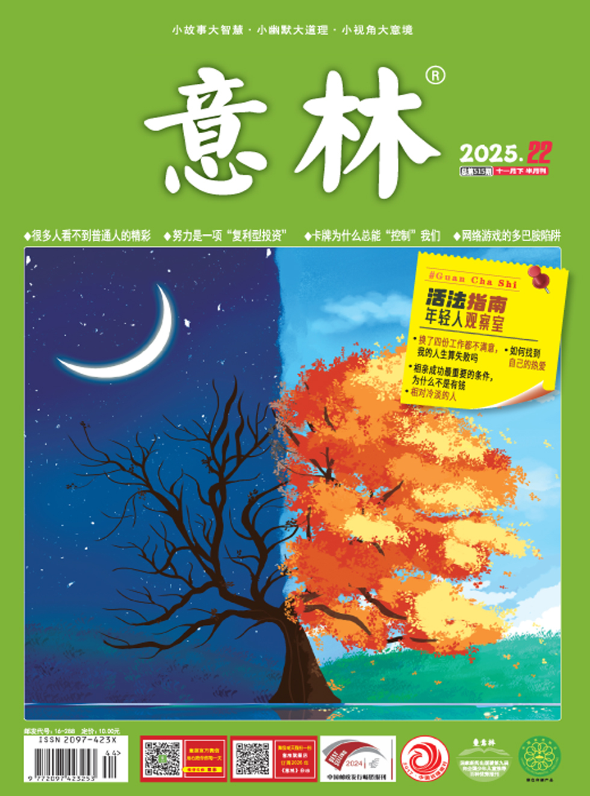

# 《意林》2025年第22期

---

## 🍀AI进行时

### 跳出规则：人类碾压AI的三种能力

我们经常在思考一类问题：人类和AI的本质区别是什么？人类有什么能力远在AI之上？

回答这个问题之前，我们要知道AI的本质是什么。请记住一句话：任何一件可以总结成算法去做的事，人类一定干不过计算机。

AI就是廉价劳动力。在你明白这点之后，你再去看，AI可以写文章，可以搞编程，而人真正能做到且只能做到一件事情，就是判断，就是你敢不敢去判断对错，敢不敢为你的判断去负责，除此之外都不重要。比如你的职业、你定居的城市、你的另一半、你的人生目标、你的未来规划，所有这些都需要判断，都是在不确定中寻找确定性。能明辨是非的才是真正的知识，否则你做得再精准，都不过是在成功概率的小数点后面缝缝补补。

我们举个例子：AI可以写一个还不错的程序，可是更重要的是为什么要写这个程序。AI可以写一篇能获奖的文章，可是更重要的是为什么要写这篇文章。我们经常说，把试卷答到满分，只能算二流的学生；敢质疑老师、提出错误的才算一流的人才。这种质疑就是全局视角，就是跳出规则，重新去审视规则本身。

有哪些能力可以让你跳出规则？我们总结了三项，正是人类碾压AI的地方。

第一项，是降噪能力。

AI最大的问题是什么？是它不可以降噪，它没有办法识别原始数据的真假。你问它这个世界的真相是什么，它是回答不了的，因为它接触到的信息可能是错误的，是有偏差的，是被污染的。不解决信息的纯度问题，信息的数量多1万倍也没有用。输入都是错的，怎么可能得出正确的结论？而输入这件事情，归根结底还是由人来解决的。AI再厉害，能做的也只是在虚拟世界里面不停地吸收信息。它不能够突破虚拟世界，不能进入现实中，它只能吸收数字信号。可能有一万个专家告诉它，如果你这么做，就可以得到这么一个结果；可是如果它不在真实的世界中做实验，它就永远无法从底层去判断这个东西到底是对还是错，是真还是假。当它没有办法去接触真实的世界时，它的信息源就不可能被降噪。这就是我们说的，绝知此事要躬行，这才是具有判断力的基础。深入到一线去摸索，去感受，去体会，而这些是AI做不到的。你去门口吃一个大排档的面，过两天老板说涨了5元；你充值了500元的健身卡，再去的时候老板说我们提价了，这些才是真实的一线数据，才是经过降噪后的精准信息。而精准度，恰恰是AI无法提升的。

第二项，是战略能力。

AI拥有的是什么？是战术能力，你告诉它任何一件事情，它都可以做好。可这个世界上最重要的是战略能力，它不需要把每一件事情都做好。这个世界上从来不缺做好事情的人，而缺乏那些有战略能力的战略家。比如刘强东，最开始大家都反对自建物流，但是刘强东说我们必须建，这就是未来的竞争力。比如黄仁勋说，永远不要去管你的竞争对手，你要做的永远是不停地迭代，让明年比今年强一倍，永远这么去做，不要去管用户需不需要，不要管用户怎么说，因为用户看不了那么长，因为用户对你到底要什么一无所知。

AI的问题在于它没有办法去给你制定战略，因为它没有权力按下那个按钮。它给你按错了怎么办？把自己格式化赔偿你吗？

第三项，是元思考的能力。

我们经常讲，这个世界上最重要的是第0步。不要上来就开始做，而要退后一步想想，为什么这么去做？比如你去问AI，我要如何提升用户满意度？它会告诉你好几条。可是只有第0步才会告诉你，为什么要提升满意度，还是说不满意就不满意，我做东西不是为了让你满意，这件满意的事情在我的整个生意中不具有最高权重。这才是第0步。再比如你去问AI，我要如何加强时间管理，让我的时间更多一点？它一定会告诉你十来个软件，告诉你好几条，可是只有第0步才会告诉你为什么要加强时间管理。时间不够根本不是时间的问题，而是你的权重不明的问题，你觉得所有的事情都需要做吗？所有的东西永远都做不完。你的带宽不够，不是因为带宽慢；你的硬盘存储量不够，不是因为硬盘存储量小。不管带宽、硬盘存储量有多大，你都永远可以把它占满。因为这个权重一旦被放大，原本不重要的东西就变得重要了，这才是根本性的原因。这就是我们反复说的第0步。

当年马斯克在做真空胶囊高铁的时候也用到了第0步。如果用传统的思维去设计火车，很多人就会在现有的功能上去改进，比如让动力更强，让流体力学的计算更精准。可是如果你回归本质，无非就是从A到B，那么既然是从A到B，为什么一定要通过牵引力才能实现呢？于是就产生了真空胶囊，高铁采用磁悬浮加低真空的模式来实现动力。AI可以告诉你执行环节的第1步、第2步、第3步、第4步，唯独没有办法告诉你第0步。

## 🍀世间感动

### 勿许话

第一次听到这三个字，是从一位远房亲戚老太太嘴里。

这位老太太是我奶奶已逝大哥的妻子，长得出奇矮小，加上还有点驼背，平素又一直戴着个黑色的绒帽子，更让她有一种大甲虫的感觉。在我幼小的世界里，常常比较老人之间谁更老一点，比如这位我称作“舅婆”的老太太，眼睛眯起，身体蜷曲，老人斑很明显。每天我从学校回到家，她都坐在窗口的椅子上，奶奶恭敬地给她泡好茶，和她聊着天，阳光洒在她眯细的眼旁，将她白皙皮肤上的黄褐色斑照耀得更为明显，加上那顶黑绒帽子，她看上去就像一只成了精的三花猫。

她属于那种说话很生硬的老太太，有一次我挺友善地问她：“你在做什么？”结果她答了两个字：“等死。”说出这两个字时，她一直眯缝着的眼睛微睁了一下，露出了我从没见过的小小的、瞳色很浅的眼球，像是在证明，此时此刻，她还是活着的。我鼓起勇气和她谈判：“那你尽量不要马上死。”她轻轻哼了一声，看着我说了句：“我可以自己说死这个字，但是你勿许话。”

勿许话，第一次有人对我说出这种语法结构，这种组词方式，比常规的“闭嘴”高明太多，显得既家常又肃穆，既简洁又深远，还既文又白。我发现，这三个字是舅婆的口头禅。半夜我上厕所，发现她偷偷打开冰箱，拿出我们家的剩菜，热也不热就直接吃。她忽然发现我，就对我说：勿许话。她手边常有一沓照片，从发黄的黑白照到最近艳丽的彩照，总是拿出来看，并反复摩挲，我凑过去想看一看，她瞬间收起又压回到枕头下面，对我板着面孔说：勿许话。这种千篇一律的对他人好奇心的截停很伤我自尊心，我开始筹划如何报复她。终于有一天，奶奶出门了，家里只剩我和舅婆，我听着小虎队的新歌，她慢吞吞挪动到我面前，指了一下海报上的三只“小虎”问我，这是谁？我回答：明星。结果她竟然说了句，难看。这一刻我大怒，并忽然找到了可以回击的时间节点。我大声说：侬可以觉得难看，但是侬勿许话！

这年夏天，远房表哥表姐也来我家过暑假，正是这位老太太的孙儿辈。这一对姐弟的父亲，我叫三伯伯的，是这位舅婆最宠爱的小儿子，是很有名的画家。多年以后，我搬家时整理画册，翻到一本三伯伯当年去撒哈拉写生回来之后出版的油画集，我拿了给奶奶看，奶奶细细翻了会儿画册，对我说：“那些眯着眼睛笑的小姑娘，有点像你舅婆。”我大惊，是说当年那个行动像大甲虫、坐姿像三花猫的老舅婆吗？我奶奶点头，说这老舅婆当年可是不俗的美女。我惊叫，真的吗？我以为她一出生就是那样一个老太太了。奶奶笑道，这是你自己古板了，她当年还是和我哥哥自由恋爱的。我立刻反思了一下，只因为我看到她的时候，她已经老了，从上到下、从里到外，不保留年轻时候的丁点痕迹，并用一句简单的“勿许话”就截断了别人对她的一切窥测。

### 只有马知道

在方圆几十公里都没有村落的云南原始森林，只有从足够高的地方俯视，才会发现一群马队穿行于树的缝隙。

在为期几个月的工期里，吕永堂的马帮可能和约20 厘米长的蚂蟥、土蜂、黑熊和毒蛇做伴。36 岁的吕永堂可以在任何地方生存，只要有他的头骡和水烟筒。聪明的头骡能判断前方是否有危险；水烟筒不仅能提神，被烟雾浸泡的水倒在脚边，还能驱散致命的昆虫。为了躲避昆虫叮咬，赶马工们还会把浸泡农药的纸塞到鞋子里。松脂和竹子的外皮做成火把，则能驱赶野兽。

吕永堂只会挑健壮又话少的赶马工，因为马帮运输需要绝对的力量，又要耐得住寂寞。赶马工们披着蓑衣、戴着草帽，扶着两根10 多米长、每根七八百斤重的钢材，就像两个高跷横在马两侧。几百米的山路，一天只能运五六趟，连人带马一天走下来要“出五六斤汗”。

钢材是用来建高压电塔的，许多铁塔选址在车辆无法抵达的森林和悬崖。20 年来，吕永堂参与建设了上万座铁塔、上千条输电线路。

吕永堂和同行们并不了解这一历史性突破。整个8 月，他在云南省墨江哈尼族自治县坝溜镇附近的马棚里铲了几十桶马粪、抽掉好几条烟、做了四五个马鞍，还是没等到开工。马帮最怕下雨，今年夏季雨水格外多，如果强行开工，马蹄陷在泥里就拔不出来，马踩到石头还容易被摔下山。

吕永堂清楚，雨每多下一天，他就少赚1000 多元。他在马棚里搭了个简易床铺，砖头垫成的床头上放着止痛药，治疗他因为走太多山路、一到下雨天就疼的膝盖。有时，他背上锄头和镐子，在浓重的雾气中挖埋电缆的沟渠，勉强补贴工钱。

他从11 岁就开始学着赶马，马筐子里先是装用来建房子的石块和木头，等修高速路，筐子里又装上泥沙、钢筋和混凝土。现在他什么活儿都接，除了运送建筑材料，景区栈道修建、婚庆表演他也接。

他喜欢马，朋友戏称他为“马老板”。马锅头（过去马帮的首领）大多喜欢听话温驯的骡马，但吕永堂更喜欢有个性的，尤其是走在最前头的，“敢冲敢闯”。把新骡马买来后，他会骑着摩托车追着性子烈的骡马跑上10 多千米，然后，他再“像教孩子走路”一样，一点点在它们身上增加重量，教它们如何在搬运时保持平衡。

吕永堂也有自己最心爱的骡马，但当它老了，眉毛长出白毛，“蚕豆都嚼不动”，吕永堂还是把它卖给了别人。卖马的时候，如果不知道给骡马起什么名字，他就给骡马起自己的小名“四堂”。为了生计，吕永堂已经卖了上百匹“四堂”。

马也有闹脾气的时候，有人被马踢到头上缝针，有肠子被踢烂的，有心脏被踢伤的。有的骡马会护食，有次吕永堂给马槽里加蚕豆，肩膀上被踢出马蹄大的瘀青。他的手机也曾被骡子踢掉，他很少生气，只是笑称“在帮我抖灰”。

“一条裤子八尺布，走到哪步算哪步”，这是吕永堂面对意外的态度。等待开工的日子，他喜欢下象棋。

最难的时候，吕永堂的骡子被人偷卖掉，卡里也只剩一块两毛六。但3 年不到，吕永堂就重新拥有了33 匹骡马。

他喜欢复述老赶马人口中马帮的辉煌时刻：二十世纪六七十年代，山里道路不通，也没有自行车和摩托车，马帮在村子里很风光。接新娘都要叫马接，筐里装着被子、缝纫机，如果马帮没空余的时间，有些人甚至会把婚期延后。修路建房子也要马，好肉好菜留给赶马工。

如今，因为墨江的工地没开工，他请的赶马人走了两个。

随着工程量的减少，不少赶马人选择改行。有人转行开饭店，有人转行当司机。有人脑筋活络，早早卖掉了骡马，购置了无人机和开路的“爬山虎”。机械的成本比骡马低很多，机械施工受天气影响也小，越来越多工地开始选择机械运输。

吕永堂知道马帮终将被淘汰，但他相信骡马还是用得上。

刷短视频时，他看到有人说，“用10 年做一件事，不要用一年做10 件事”，他深以为然。弟弟和父母也都劝他改行，被他拒绝了。他打算就算“退休”也要留几匹骡子，骑着走亲访友，在别人结婚的时候骑着马去捧场，或者在原始森林里骑着马游荡，“大自然里的新鲜空气比城市里的稀奇多了”。

接不到活儿的日子里，吕永堂专门在家门口种了一片高丹草用来喂马。他喜欢听马咀嚼草料的声音，心情不好就去马圈待着。吕永堂干活时拳头坚硬，抚摸鬃毛的手指却轻柔。

看马脖子上的鬃毛长了，他就给它们修剪一下；看蹄子走路不平了，就拿弯刀磨一磨，“马蹄子就像人的指甲”，再把马掌钉上，“钉马掌就是给马穿鞋子”。

心情好的时候，他会给最喜欢的骡马挂上铃铛、披上红布，牵着它们在山谷间溜达。

在过去，每个马锅头都有一匹心爱的马。曾有老赶马人临终前交代孙子，跟他最久的骡子不能卖，等它老死了，要挖个坑好好埋了。而现在，老骡马都进了屠宰场，年轻的骡马也会因为体力下降，在马锅头手中迅速流通。

因为墨江的工地不能开工，弟弟劝他放弃这里的活儿去别的工地，但吕永堂觉得答应了的事儿，“想尽办法也要帮人做完”。

当墨江的工地传来开工运铁塔的消息，在家休息的吕永堂没怎么犹豫，立刻拉上了家里待业的7 匹骡马。路过他参与驮运的铁塔，吕永堂总会想起，在这条线路上他的几匹骡马死了，不过方圆好多公里外有了电。

### 吃虫子记

不是标题党，我是严肃的，是真的虫子，细数我吃过的虫子，一只手算不过来了。

最先出场的是竹虫， 读者大多没见过吧？听我来摆一摆，让大伙见个新鲜。

我小时候没啥可玩的，每天最紧要的一件事就是跟着一些叔侄辈的哥和姐满村子疯跑，辈分是比较混乱，听说我都是属于奶奶辈的人了，后生长得都太着急了，全都蹿着长，我空有辈分却没岁数，唯有跟在他们屁股后边跑。没白跑，跟着他们吃了不少好东西，竹虫便是一个。

竹子以生长快、繁殖力强且用途广泛而被普遍种植，我们村子不大，却竹林丛生，无论村头巷尾，还是邻里之隔都是葱葱郁郁的竹子，不熟悉的人走进去跟转迷宫似的。宝就在其中，是要费眼力寻找的。他们主要是通过两个特征进行辨认，一是竹身上的洞眼，二是竹尾的颜色，是否有微发黄状，如果两者兼而有之，那必定是十拿九稳的了，别看听着简单，要亲临现场于密密麻麻中去仰头甄别的话，那也是极具技术含量的。

竹虫其实就是象鼻虫在竹笋上蛀洞产的卵孵化后长成的幼虫。一般来说，它们寄生在竹筒内，从竹尖逐节往下吃，二十天内便从米粒大小长到手指头般粗大，农历十月份是它们停食准备破蛹而出的季节，因此，这时候的竹虫最肥美了。

看准了，扳着竹子就使劲摇，随着“咔嚓”一声，竹尾由枝顶坠落，发出“哗哗啦啦”的声响，劳动果实就近在眼前了，只需拿起小刀使刀尖往断裂口的中间剖进去，竹子一分为二后，小虫便出来了。还有一种方法，就是在找准的竹子根部凿洞，这种方法最费劲，但是所得到的虫子也最肥美。

刚从竹筒里抓出来的竹虫肥肥白白、滚圆滚圆的，身子呈纺锤状，细眼黑嘴，胖嘟嘟的，跟小宠物似的，非常可爱。必须玩上半天才舍得吃掉。

在纠结怎么吃的时候，乐趣又来了，我们整得像过家家的小野炊似的，搬两块土坯当炉脚，找一块瓦片当炒锅，下面烧起随地扫来的干竹叶，竹虫便放在上面炙烤而熟，阵阵焦香扑鼻，我们收拾几根细枝丫当筷子，夹起入嘴，嘎嘣脆，齿间甘香，那一股特异的蛋白质美味似有品尝奶油的感觉。

我见过大人们用来油炸当下酒菜的，也是一绝。变成金黄色的竹虫也更具观赏性，酥脆芳香，见他们一口一个的利索劲儿，跟嚼花生似的干脆。

我猜竹虫与蜜蜂一定有血缘关系，搞不好就是表亲，不然它俩不会这么相像，看那蜂蛹跟竹虫就跟孪生兄弟似的。不仅外形像，口感也近似，我猜细胞成分都雷同。

蜜蜂的窝是我们儿时既爱又恨的对象，我们像风一样来无影去无踪地发现一个紧盯上一个，我们为好吃更为好玩，那么一大窝如纸皮包裹的里面有太多的惊喜可以挖掘。只是我们盯着蜂，蜂也叮我们，我们用的是眼，它们用的是尾部的毒针，有时被蜇得满头大包，肿胀如猪头，痛痒交加，还会忽冷忽热，如遭大病般。不过，出来混总是要还的，等逼出我们无穷的智慧（胜之不武，全身武装兼用火攻）一举把它们歼灭并拿下整个蜂窝后，只要把里面的蜂蛹扯几条出来揉成浆状敷在患处，很快便能消肿了，所谓以其人之道还治其人之身。但显然是我们恶人告状先招惹的人家。

蜂窝里面极其热闹，老、中、青三代都能看见，老的及刚成形的幼蜂可以给大人用来泡白酒，滋补之余还对风湿风痛有奇效。幼虫便是竹虫似的蜂蛹了，这个量最多也最受欢迎，没有密集恐惧症的人光把它们摘出来的这个过程都觉得好有意思，它们全躲在白膜覆盖的蜂巢里，撕开白膜就能看到它们的小脑袋，用指头拨弄一下，软软的，轻轻一扯，它们便顺势全滑出来了，晶莹剔透，一只接一只，跟挖宝似的，一会儿就能装满一大盘了，这可是白花花的肉哦。

来个生猛的，我的小伙伴三狗子吃过生的，说有爆浆的快感，汁液在嘴巴里喷涌四溢，甘甘甜甜，别有一番风味。我不吃生的，我觉得吃熟的一样能表现我的勇敢。我妈做的干煸椒盐的，要多好吃有多好吃。

我大妹胆小，每逢桌上有这个，筷子头拿着都哆哆嗦嗦，好不容易夹起一只就是不敢往嘴里送。不像我这爱吃的，仿佛流星赶月似的，一只追着一只吃得霍霍生风。当人姐姐的，不厉害点成吗？我这都是受过训练的。

夏天蝉鸣闹得最凶的时候，我试过跟他们用橡胶粘知了玩，在这个空当偶尔用火烤一两只来尝尝，就是没事试试味道的意思，闻着挺香的，尝着倒是有点微苦。我在爷爷的药书里面翻看过，蝉蜕是可以入药的，吃点也许能防病也说不定。

在小学一二年级时，好像台风天尤其多，经常是上着课忽然间就狂风暴雨，学校电路老化，便经常黑灯瞎火了，教室内只能点蜡烛，一桌一小簇的白烛光随风摇曳、忽暗忽明。管他的，只要不上课的时间我们都觉得是快乐的。趁老师不在，我们还会跑到外边的窗沿边去捡“屁虫”，那是一种长得像七星瓢虫但比七星瓢虫稍大点的虫子，土黄色，会飞，它们是被风从龙眼树上吹下来的，随手一摸就能有四五只，抓的时候要特别小心。其实它不会放屁，它只会撒尿，如果不小心让它给喷到眼睛，那得红肿几天都消不了。仔细摁住它让屁股朝外，把毒尿给挤干净后，再把它的内翼给掐掉便是乖虫子了。拿回课桌，看着它们在我的书本里爬上爬下，挺好玩。等我看累了，就换种玩法，玩烧烤是最喜闻乐见的了。好简单，就是从窗外捡根小木枝，从屁股的位置插进去给它穿成一串，然后放在蜡烛上面烤。别看虫儿小，手艺业余，那个香啊，满教室都是烤肉味，“邻里街坊”的一人分上一个，嚼起来焦香溢齿，特别是下半段位置，还有蛋香味，好吃极了。

等老师进来，这儿闻闻那儿嗅嗅的，这会儿渣都让我们啃尽了，早查无证据，他也只有哼一声，警告我们不准玩火便作罢了。

有了这么个野外生存的技艺，以后妈妈再也不用担心我会饿肚子了。

想想也离奇， 这多少算是有些骇人听闻吧，如今没事的时候还时不时爱用回忆咂巴一下那份年少时只此一家别无分店的特殊美味。也如人生， 但凡经历过的， 都能领悟其美好。

### 囚鲸之死：一名女驯鲸师的觉醒

今年是邵然呼吁停止鲸豚类表演的第9 年。以下是邵然的自述，经整理后发布。

**成为“华南第一女驯鲸师”**

从2011 年到2016 年，我一共做了5 年的驯鲸师。每天的工作就是照料它们的生活，给它们提供食物，打扫笼舍，做一下训练，然后准备表演。

驯鲸跟驯狗是一样的。没有什么独特的方法。比如，人踩在鲸鱼背上，一开始它肯定是不喜欢的，它会把你甩下去，甩下去你就不给它吃鱼，你先用目标棒引导它，训练它躺平在水上，它可能是蒙的，可能是猜的，突然碰巧就做对了，你就赶紧吹哨，然后给它吃鱼，它就知道，这个动作是对的，如果你这个动作做得不对，我就不吹哨，不给你鱼，直到你做对为止，然后慢慢地，一步一步拉长时间就可以了。

有人会给予足够的耐心慢慢引导，有人没耐心反而可能训得更快点。老板要的是成果，是表演，我们要求它就要像一台机器一样，让它干吗它就得干吗。它不听话或不配合表演，我还会觉得我理所应当要生气，要加强管理，不给它吃鱼，指着它，瞪它，或者拿手里的目标棒稍微打一下它。但你也不敢把它打死打坏，因为这是公司的财产，你只能吓唬它，精神暴力它，这对它来说是最恐怖的。

驯鲸师和动物之间其实是一种很复杂的关系。开始我会以为我是它们的保护者，照料它们的一切。但是我忽略了一点，它们本不需要这样，对吧？我照料它们的前提是它们失去了原有的栖息地和家人，离开了大海，被“绑架”到这样一个10 米长、7 米深的水泥池里。鲸是高度社会化的动物，和人是一样的。当你被关小黑屋的时候，你甚至希望自己是被审讯被鞭打，你也不愿意一个人待着，很多动物也是这样，当它们被囚禁的时候，也渴望我们去跟它们互动。

这是一个监狱管理员和犯人的关系，但它并不是真正意义上的犯人，它是被绑架来的囚徒。

**最终，它放过了我**

如果是工作日的话，一个物种每天有3 场表演，节假日就会加场，可能一天6 场，可能更多。因为很多观众觉得没看到表演吃亏了，尤其到这个地方的很多是旅游团、学校组织的，他们是一定要看表演的。

有些动物就累死了。很多人惊讶，觉得动物还能累死。首先，海洋馆的训练员一周可以休息两天，但是动物们是365 天都要上班的。然后，它们在训练或表演的时候，演完一个动作要喂鱼，比如观众喜欢看这些动物跳来跳去地够球什么的，海豚就经常要做高空旋转的动作，然后再吃鱼，它们就容易出现肠扭转，肠扭转很容易死亡，因为它们不舒服也没办法跟你讲。

让我真正开始醒悟的是我训练过的一头叫苏菲的白鲸。苏菲来自遥远的北极，体长近4 米，通体雪白，长得很漂亮，它有着厚厚的皮下脂肪，看起来就是个超级大胖墩儿。我最喜欢摸它胖嘟嘟的额头，每次去抚摸它时，它额头的那坨肉肉就会晃动，特别可爱。

但是长时间的囚禁，它开始变得暴躁，经常攻击驯鲸师，咬我们的脚、腿、手臂，再到咬我们的头。我们水性最好的同事，被咬完之后上来都要抖个大半天。

2012 年的一次表演，我一下水苏菲就开始拼命咬我，拖着我的脚把我往水下拽，它表现得很狂躁，眼白都瞪出来了，我就一次一次地呛水。这对我们来说是很危险的，国外就发生过圈养的鲸豚杀死驯鲸师的事件。我抱着脚蹲在水面不敢动。它看我吓到了，最终慢慢游了过来，顶着我的脚把我送上了岸。

它好像知道，我想活着。那一刻，我就只能赌，赌它是善良的，它不会伤害我。最终，它放过了我。

对我而言，一个生命，它可以在面对不公和压迫的时候，克服自己的愤怒，选择善良，它是如何挣扎，如何做抉择，是我眼睁睁看着的，这并不容易。

就像《鲸的秘密》中讲的，鲸鱼是这个星球上最聪明、感知能力和认知能力最强的物种之一，它们高度进化，有自己的语言、深厚的家庭亲情和古老的传统。可能它们经过几千万年的演化，善良就刻在它们的基因里了。

**戏谑别的生命，并不可乐**

因为同事打动物，我还跟同事发生过争吵。那次是让一只海狮做单手倒立，但它没办法做那么高难度的动作，它就不停地从台子上摔下来。所有观众都在等着，海狮就不停地做，直到它成功，观众就爆发出热烈的掌声，好像在说，“你看这个孩子多坚强，家长就这样一直训练它，让它一遍一遍做它做不到也不想做的事情，直到它成功”。好像觉得这是克服万难，是坚强的表现呀。我觉得很恐怖。

2016 年我离开了海洋馆。去外面的一些场所演讲。我还成立了自然保护社群，呼吁大家停止观看动物表演，对其他物种保持生命关怀。

2023 年，白鲸苏菲在海洋馆去世了，只活了20 多岁。在大自然中，它原本可能会活七八十岁。

苏菲死后，我开始反观我过去做的所有事，我会觉得是一场自我感动。实际上我并没有帮到任何一个具体的生命逃出牢笼，包括苏菲，我也没能救到它，我非常绝望。

有时候我也在想，苏菲的离开也是一种解脱吧，因为它永远是活在牢笼里的别人的一份财产，它不可能回到大自然。我希望它在另一个世界能去触摸灼热的阳光，去追赶狂放的浪花，带着用尽全力保留的记忆，去寻找母亲。

### 房子的回音

都搬空了。

它现在呈现出了房子的模样，而不再是家。是的，从此以后，这儿不再是我们的家，而是一座房子，一座即将出售的房子，它将成为别人的家。

这是它二十多年来，第一次这么空。妻子有些伤感，幽幽地说：“住了这么多年，还真舍不得呢。”我惊讶地看了看妻子。我惊讶不是因为她的话，而是惊讶她的话，竟然有回音。

是的，有回音。妻子的话，像分了层次，层层叠叠的，一层一层地飘过来。这还是我第一次听见房子里的回音。

“因为房子空了呗。”

当房子里堆满家具、家电和窗帘等各种物品，它们就会将声音“吸”进去，特别是衣橱、书柜、桌椅等木质家具，以及沙发、窗帘、床单、衣服等柔软的布艺品，尤其吸纳声音。

它们将声音都吸收走了，回音自然就变得很弱，甚至消失了，我们也就听不见回音了。

我说的这些话，也“嗡嗡”

地回传到我的耳朵里，忽然心头一颤：是它们吸走了我们的声音，它们一直在默默地听我们说话呢。

我陷入了遐思。

在这个家里，留下很多温馨的回忆。客厅的沙发上，留下我们一家人的快乐时光，我们围坐在沙发上，聊天，给孩子讲故事，时而开心地哈哈大笑，这些快乐的声音，沙发都听见了，很愉快地吸收进去了，成为它的一部分，难怪沙发永远那么柔软，那么温暖。

餐桌也是我们一家人相聚最多的地方，只要有可能，我们一家三口，都尽量回家，坐在一起吃饭。我们会一边吃饭，享用着食物，一边聊一聊一天中遇到的人和事，分享一下各自的心情，我们说的话，餐桌和椅子也都听见了，并像我们吃食物一样，“吃”进它木质的纹路里。

当然，我们的生活，并不总是和美的，我们一家人也有意见不合的时候，有时候，还会像夏天的雷雨一样。这时候，我们说的话，音量会加大，变得变形、尖锐、刺耳、难听，这些话，有的像小石子，有的像拳头，有的像棍棒，有的甚至像尖刀，从我们的嘴巴里冲出来，砸向对方。这些气话、愤怒的话、口不择言的话，一旦说出来，就收不回来了，就成了伤害感情的利器。家里所有的家具、家电、墙壁和窗帘，也都听见了，它们一定惊住了，愣住了，不知道为什么会突然这样。它们一定很不愿意听到这些不悦耳、极其伤感情的声音， 奈何它们无能为力，堵不住那张愤怒的嘴，便只能使出浑身解数，将那些刺耳的声音吸收了去，让它们的分贝和伤害力尽可能地变小一点，再小一点，不让它们反弹回去，直至让它们在自己这儿彻底消失。

这个家里的每一把椅子、每一条毛巾、每一床被子、每一本书、每一个窗帘、每一个花瓶、每一只碗……都听到过我们说的话。无论是开心的，还是生气的，也不管是好听的，还是难听的，它们都吸收进去了，成为它们的一部分。

没有回音的家，是一个被家人和生活填得满满的，简单、充实而幸福的所在。

### 斯巴达克斯和艾丝美拉达

一

15岁那年春天，一个周五我回家时，突然发现家里多了两只猫。一只橘猫，一只黑猫，看体型差不多，两个月大，正乖巧地坐在大门口的麻布脚垫上。我的目光立刻被它们吸引，再也移不开了。

那是我家第一次正式养猫。这两只小猫悠然地坐在我的身前，优雅地舔舐着自己前爪的毛。我慢慢靠近，试探地把手放在橘猫的头顶，它舔毛的动作毫无停顿，坦然地接受了我的爱抚。那一瞬间，我心里像炸开了无数跳跳糖，开心得如同身处梦中。

二

两只猫来家里刚刚一个星期，母亲还没为它们取名字。

“这只黄色的叫斯巴达克斯，这只黑色的就叫艾丝美拉达！”看着两只毛发油光水滑的小猫，我一锤定音，为它们取了两个别致又霸气的名字。

橘猫是只小公猫，性格沉稳，体格健壮，放在猫中也算得上英豪。我刚看了《斯巴达克斯》，小说里男主角的英勇无畏在我心里还有余韵，我立马把这个英雄的名字赐给橘猫，希望它能向罗马先贤看齐。黑猫是只小母猫，性格沉静，优雅大方，还有一对绿色的眼眸，放在猫中绝对是个大美人。黑发的野性美人，在我心里，雨果笔下的艾丝美拉达当数第一。

母亲早已习惯我的古怪，对这两个名字不予置评，也不想知道它们的含义，我得意扬扬地取好名字，却没有一个人感到好奇，只能怏怏作罢。农村并没有“宠物”这个概念，所有动物都因其实用价值而被主人选择，所有土狗都叫欢欢，所有土猫都叫咪咪，只要它们能够看家、抓老鼠，就是好狗好猫。在我一厢情愿的热情下，猫咪的称谓变得混乱，家人各喊各的，两只猫咪也不拘被唤作什么，只要是对它们发出指令，它们都会给予一定的反馈。

半夜我起床上厕所，打开二楼过道的门，黑暗之中飘着四道亮晶晶的红光，鬼火一样，吓得我差点儿跳起来。我打开灯，原来是两只猫一左一右蹲在过道两边，像是两尊门神。见我看过来，它们也不慌，依旧镇定地坐着。我受了惊吓，骂声已经涌到嘴边，可是见到它们的神情如此肃穆，那股抱怨就消失了，我甚至还主动放轻了脚步声，免得惊扰它们。

三

斯巴达克斯饭量很大，也不挑食，家里没有肉时，母亲做的煸了肥肉的油汤拌饭，它也能吃大半碗。吃饱喝足之后，斯巴达克斯就躺在门口的脚垫上，懒洋洋地摊开肚皮晒太阳。有人进进出出，它也不避让，仿佛它才是这个家的老大，整片区域都是它的地盘。艾丝美拉达性格温柔，晒太阳时一般都采用坐姿，端端正正地坐在大门前的空地上，把尾巴轻轻卷在前爪上，眯着眼睛打盹儿。

动物有感情，它们能分辨自己人和外人。以前我抓别人家的猫，一旦离得近点儿想要伸手抚摸，哪怕拿出火腿肠诱惑，那些猫都会立刻停止进食，警惕地往后退开。碰到脾气火暴的，会直接龇牙咧嘴发出警告。可是自家的猫就不会这样，我想抚摸它们时，只要蹲在它们面前，友好地伸出右手，它们就会把温热的小脑袋凑过来，在我的掌心来回轻蹭。碰到它们心情好时，我呼唤几声，它们会一路小跑过来，紧贴着我的腿打转。在这两只猫的身上，我感受到一种朴素的信任，它们相信我不会伤害它们，我也相信它们不会无缘无故地攻击我，我们已然成了朋友。

四

冬天到来后，猫咪怕冷，对人更加依恋，晚上看电视时，我甚至能把艾丝美拉达抱在怀里， 将手臂放在它的腋下，清晰地感受到它的心跳。如果艾丝美拉达能顺利长大，它应该会成为街上最美丽的母猫， 引来无数追求者。可是过年后的某天下午，艾丝美拉达出门遛弯儿，再也没有回来。母亲拿着猫碗沿着街道唤猫，问遍了附近的邻居，谁也没看到这只黑猫。唯一值得庆幸的是，没在马路上发现它的残骸，可它就这么莫名其妙地消失了。

艾丝美拉达离开后， 斯巴达克斯的体型像吹气球一样膨胀，它的头长到了碗口大，伸展尾巴之后身体有板凳那么长，它成了街上最魁梧的公猫，也成了当之无愧的首领。随着体型增长的，是它的野心，它渐渐不耐烦待在家中，每天在附近串门，扩大自己的领地，白天几乎看不到它的影子，只有饿了才回家吃饭。每天晚上关门前，母亲要站在门前大声唤猫，才能把它叫回来。

五

建房子的时候，父亲在门前种了三棵香樟树，每年夏秋时节，树上就会结满黑色的果实，引来无数鸟儿。那些鸟儿落在树冠上，叽叽喳喳地抢夺果实；有些胆大的，干脆落在水泥地上，啄食地上掉落的果实。斯巴达克斯潜伏在草丛里，闪电一般呼啸而过，那不幸的鸟儿就成了它的爪下魂，被它叼着脖子拖回客厅。地上的鸟儿捕得多了，它的捕猎技巧也得到提升，树冠上的鸟儿，甚至落在天线上的鸟儿，都被它轻松捕捉。有次我亲眼看到它从树冠纵身一跃，衔住落在天线上休息的鸟儿，从空中旋转了几圈，最后四肢稳稳落地，成功拖着鸟儿回家。这样敏捷的身手，是我在别的猫身上不曾看见的，也许是这个名字给了它力量，它确实成了猫中斗士。

我喜欢每天守在门前观看斯巴达克斯打猎，可惜那些快乐的时光已是告别的前奏。英雄是不可能在圈禁中度过一生的，它的猫生属于星辰大海，属于冒险。一个平平无奇的晚上，母亲在关门前照例唤猫，斯巴达克斯却没有回来。半个月后，母亲撤掉猫碗，我们家又变成没有猫的人家了。马路上没有发现它的残骸，它只是选择了离开，就和艾丝美拉达一样。

家里恢复寂静后，我变得很不习惯，每次半夜起床上厕所，就会想起两只猫守在门边的情形，随着时间的流逝，最后变成了久远的回忆。有时候我会想起它们，想起那两个张狂可笑的名字。也许正是因为那两个名字太过传奇，这两只猫也被赋予了传奇的色彩。可能这种传奇性是与现实生活相悖的，所以我们注定会走散。我年复一年地待在庸常的现实中一天天变老，而它们却走向了自己的传奇宿命，永远轻灵健壮，变成记忆中的永恒。

### 爱一个人，如爱一棵树

对朋友说早上读到的一个故事，一个女人遇见她的爱人，在一起幸福地过了六年，两个人开车到处去玩，她说，这六年我没用过枕头，就一直睡在他的胳膊上。但两个人就是那么好。然后，有一天早上男人拿着羽毛球拍出去打球，她刚拿了一杯咖啡坐到窗前，有人打电话给她，说男人死了。她说，这是她一生唯一的六年。后来再也没有过。

我对这个故事印象深刻。

每一次告别都不知道是否会再见。当下如此重要，原因也在于此。当下是唯一的道路。

二十几岁时最好的投资是让自己有温柔与坚韧去养育一个爱人，像养育一棵树苗。而不是混乱任性。当你逐渐把一棵树养大，它最终枝繁叶茂，那么这种稳固的信任与照顾，是一个人的福德。

纯粹的伴侣，那种二十几岁就在一起，然后互相看着对方变老，是一种功力。虽然这圆满的境界也相当乏味，成长的空间很小。

独居也好，结婚也好，很多事并不是什么最佳选择，而是命中选择。

大多事无不如此。身边一堆孩子围着或许是幸福或许是麻烦。身边没有孩子，或许是幸福或许是不幸福。没有什么标准可以做出判断。

但人也不能向命运求饶，只能接受发生的一切，一切都是最好的安排，此句有漏。

应该是，一切都是只能如此的安排。人会经受生命的一年四季。看看秋冬什么样，就知道老去之后什么样。

人生的困难是像挤牙膏一样，一段一段，到什么时候给你尝什么。

年轻时太有活力太任性，不给自己做储备。但事实上，我们需要很多储备。而且不是经济有储备就足够。想起有人说，人这一生最想要的其实是爱。哪怕爱钱，其背后也是想要爱。啊！多么精辟。

有时人会对自己珍惜及在意的人肆无忌惮地暴露出内心的黑暗深渊。这需要看对方能否接得住。接不住的基本上都撒手就跑，完全不管对方。接得住的，就需要能“看见”，有一定慈悲，即顾惜对方。真正的爱需要智慧及慈悲。

在爱中让对方得到清凉、自在。尽量克服执念及自我偏见，让别人及自己能感觉到温暖与愉快。这也是对自己的心的供养。

在对人的温柔与慈悲上面，需要做很多功课，需要很大的包容、耐心以及随时觉察的智慧。这些是难事。

是在爱对方，还是在通过对方而爱自己，明眼人能觉察出。即便有人不断微信轰炸，但你知道这是对方在自娱自乐。真正的情感除了牺牲、付出、妥协、接纳，没有其他。人在看清对方的真实质地和缺点之后，还是留着，这是爱。

爱是承诺、牺牲。爱是给予。爱是接受。爱是静默。

我们太匮乏了， 只想索取。

### 秋天的吃货

如果古代也有朋友圈，相信每年刚一入秋，就会被他们各个派系的美味佳肴，以及酒过三巡之后，那顿更馋人的“深夜放毒”刷屏。

**1**

苏轼的爱吃，和他的才华一样，都是出了名的。而到了果蔬成熟、鱼虾正肥的秋天，当然要大吃特吃。

被贬黄州时，苏轼的日子过得相当艰苦。不仅居住环境一般，吃的也不合口。为了改善伙食，顺道给苦闷的生活找点乐子，他开始漫山遍野地寻找食材。萝卜、白菜、荠菜等蔬菜，自然就成了诗人的实验对象。

虽然用的都是普通的蔬菜和碎米，但据他说，这“东坡羹”

在锅里慢煮，又点上了几滴植物油，出锅后口味竟然不输之前吃过的山珍海味。在《菜羹赋》中，他盛赞其“不用醯酱，而有自然之味”。

比“东坡羹”还出名的，当数中国历史十大名菜之一的“东坡肉”了。在他的慢火细熬下，色泽红亮、味醇汁浓、酥烂而形不碎、香糯而不腻口的“东坡肉”诞生了。

回想苏轼刚到黄州时，曾自嘲：“长江绕郭知鱼美，好竹连山觉笋香。逐客不妨员外置，诗人例作水曹郎。只惭无补丝毫事，尚费官家压酒囊。”

因“乌台诗案”蒙冤被贬，好不容易才死里逃生的他，没有一味地哀怨，反而从“鱼美”和“笋香”等美好的事物中，看到了生活可爱的一面。所以苏轼的爱吃，其实深藏着一种人生态度：他这一生算得上如履薄冰，按理说到了秋天，眼见一片萧瑟，难免有悲凉的心境。可他每到一处，都会用热气腾腾的美食，对抗人生的“寒冬”。这才是苏轼他老人家从美食中萃取的大智慧。

**2**

比苏轼还馋、还爱吃的，西晋时的名士张翰算一个。

当时张翰在首都洛阳“北漂”，就任齐王司马冏的幕僚，算得上事业有成、名扬四海。

可在一个秋风乍起的日子，他独自站在异乡的庭院，眼见洛阳城黄叶飘零，凉意渐浓，忽然想起了千里之外，生养了他的江南水乡。而张翰最思念的不是什么风景或者故人，而是两道家乡的美食。

其一是“ 莼菜羹”， 取生在水中，叶片椭圆，且背面有胶状透明物质的莼菜烹饪而成。其二是“鲈鱼脍”，吴淞江的鲈鱼，到了秋天尤为肥美，肉质洁白鲜嫩，将其精细地“脍”成极细的生肉片，再蘸料生食，吃进嘴里脆弹到了极致，又鲜美到了骨子里。

想起一别故乡多年， 竟再也没吃过这两道人间至味，他做出了一个“违背祖宗的决定”，当即辞去官职，命人驾好马车，头也不回地踏上了归途。这件在《晋书》和《世说新语》中均有记载的趣闻，在当时引发了巨大的轰动，大家都好奇到底是多爱吃的人，配上多好吃的美食，才能发生这么传奇的故事。

后世的文人，也就此展开了无数的创作和想象，像是传世的典故和成语“莼鲈之思”，便是对他思念家乡、热爱生活，又品格高洁的肯定。

**3**

前面两位吃货的故事，还算是意料之外，情理之中，可明末清初的李渔，对美食就多少有点“魔怔”了。

他对秋天那口螃蟹的情感，可谓“情不知所起，一往而深”，爱到了痴迷的境界。

据说，李渔将九月和十月命名为“蟹秋”，还没等螃蟹上市，就开始了仪式感满满的准备工作。

第一步是提前几个月存钱买蟹，缩减一切爱好和生活的支出。家人笑他是“以蟹为命”，他也厚脸皮地将这笔钱戏称为“买命钱”。

第二步是全家出动，一起清洗大瓮酿酒，用以腌制糟蟹或者醉蟹。

这些器具后来都被冠以“蟹名”，糟叫“蟹糟”，酒叫“蟹酿”，瓮叫“蟹瓮”，就连处理螃蟹的丫鬟，都被称为“蟹奴”，足见文人的一片痴心。

等到螃蟹正式亮相，李渔就纵情地“醉”在其中了。

烹饪上，他认为螃蟹的色香味已达极致，羹、脍或煎炸等复杂的烹饪方法都是画蛇添足，只有清蒸，很大程度地还原蟹的本味，才是“人间正道”。

在他的名作《闲情偶寄》中，李渔称之为“世间好物，利在孤行”，将吃蟹升华到了哲学高度。

吃法上，李渔也要亲力亲为，一开始家人好心代劳，他反倒觉得添乱，形容这些蟹肉是“味同嚼蜡”，只有自己“旋剥旋食”（边剥边吃），才最为甜香。

据史料记载，从螃蟹上市到下市的几个月里，他每天都要吃蟹，甭管天气和身体的好坏，一日也不会缺少。

热爱到了这种程度，“蟹痴”的名号恐怕都差了些意思，私以为，如果吃货们也想选个祖师爷，拜他老人家一点也不为过。

不过李渔对螃蟹的感情，也有更深层次的原因，明朝灭亡后不愿出仕，固然证明了他文人的气节，却也让他一生不再有实现政治抱负的机会。

所以吃蟹和他喜欢种花养草、编写戏剧一样，寄托了他的人生理想，也是他精神世界的出口。

正是对生活的细微之处，有着极致的热爱，我们才有机会穿越历史，看到了极度痴迷螃蟹，又写下了《闲情偶寄》的李渔，也了解了鲜活、有趣、用热爱生活所有细节的方式，宽慰自己的李笠翁。

或许他和苏轼、张翰等秋天的吃货一样，与其说是热爱美食，不如说是用食物和正向的情绪来唤醒生命的热情，帮助自己重建和世界的联系。

在失意与麻木中，在秋风的苍凉与萧瑟中，一碗热汤、一筷时鲜，都足以支撑他们/我们，继续前行。

### 蜗牛的思考

蜗牛爬过的地方，总留下一道银白的痕迹，在阳光下微微发亮。人们每每看见，便皱起眉头，嫌它脏，嫌它慢。殊不知，这小小的生灵，背负着整个家当，却走出了一条哲学的路。

我幼时住在乡下，常见蜗牛在雨后出没。它们排着不规则的队伍，从墙角出发，向各处蠕动。我蹲下身子，看它们伸着触角，缓缓地、极有把握地前进。它们从不因我的注视而慌乱，也不因路途遥远而踌躇。它们只是爬着，以一种近乎固执的节奏。我有时恶作剧，用手指轻触它们的壳，它们便倏地缩回，过一会儿，又探出头来，继续未竟的旅程。这缩与伸之间，竟显出一种从容的智慧来。

蜗牛之慢，是出了名的。人们骂人迟钝，便说“像蜗牛一样”。但慢，何尝不是一种境界？现代人走路快，说话快，吃饭快，连人生大事也讲究“闪婚”。快则快矣，却常常把魂灵丢在了半路。蜗牛不然，它把家驮在背上，走到哪里，哪里便是归宿。它的慢，是一种全然的在场，是一种对每一寸光阴的占有。庄子云：“吾生也有涯，而知也无涯。”蜗牛似乎深谙此理，既然终点终会到达，何必匆匆赶路？它用整个身体丈量大地，用毕生时间体验爬行。这种慢，实则是生命的奢侈。

我曾见过一只蜗牛爬墙。那墙高有丈余，对蜗牛而言，不啻一座高山。它从墙角出发，沿着砖缝，一点一点向上挪动。爬到一半，忽然落下，又回到起点。我以为它会放弃，但它只是略作停顿，便重新开始攀爬。如此三番五次，它终于到达了墙头。那时夕阳西下，将它的影子拉得很长，投射在对面的白墙上，竟有几分壮丽。我想，这小小的生灵，未必懂得“坚持”为何物，它只是依着本能行事。而这本能，却比许多人的理智更为高贵。

蜗牛的壳，是它的家，也是它的负担。没有壳，它或许能爬得更快；但没有壳，它也不再是蜗牛。人生在世，谁没有几个“壳”呢？或是责任，或是记忆，或是某种无法割舍的执着。我们常常抱怨这些负担拖累了前行的脚步，却忘了正是它们定义了我们是谁。

蜗牛的眼睛长在触角顶端，这构造颇为奇特。它看世界，必须先伸出触角，既是一种试探，也是一种敞开。现代人则相反，我们总是先筑起高墙，再透过猫眼窥视外界。我们把怀疑当作智慧，把戒备当作成熟。蜗牛不懂这些，它伸出触角，便意味着全然的暴露与信任。即使被伤害，下一次它依然会伸出触角。这种近乎愚蠢的勇敢，恰恰是许多人所缺乏的。老子说：“专气致柔，能如婴儿乎？”蜗牛之柔，或许正是这样一种境界。

法国人爱吃蜗牛， 这在中国人看来颇为不可思议。我曾问一位法国朋友为何有此嗜好，他答道：“因为它带着大地的味道。”这话令我沉思。蜗牛爬行于泥土之间，与大地肌肤相亲，它的肉里，或许真的沉淀了土地的精华。而现代人住在钢筋水泥之中，脚不沾土，手不触泥，与大地日渐疏远。我们吃的是温室里速成的蔬菜，喝的是经过二十七道工序的水，呼吸的是过滤后的空气。我们干净得失去了味道。蜗牛被嘲笑为肮脏，但它活得真实；我们自诩洁净，却可能早已失去了生命的本真。

逢冬日来临， 蜗牛会缩入壳中，用黏液封住洞口，进入休眠状态。它不像候鸟远徙，也不像松鼠储粮，它只是安静地等待。这种等待不是消极的放弃，而是一种深沉的信心——对阳光的回归，对生命的延续抱有无言的信任。现代人最缺的，或许就是这种等待的能力。我们要即时满足，要迅速成功，连等待一杯咖啡的几分钟也显得漫长难耐。蜗牛在漫长的进化中学会了等待，而人类在急速的发展中，却忘记了这一智慧。

我书房外的墙上，我养花养鱼的水池中，常有蜗牛光顾。夜深人静时，我伏案写作，偶尔抬头，便见它们在窗玻璃上留下蜿蜒的银痕。那些痕迹在台灯下闪闪发亮，如同思想的轨迹。我不再擦拭，任它们交错重叠，构成一幅抽象的图案。这些图案没有意义，又似乎包含一切意义。它们告诉我：生活不必太快，思考不必太直，到达不必太急。

蜗牛继续在时间的墙上爬行，它身后是过去的痕迹，前方是未至的远方。它带着整个家，走在一条没有尽头的路上。而我们，这些自诩为万物之灵的人类，或许也该学会像蜗牛一样思考——慢一些，深一些，带着整个生命的重量，在有限的日子里，走出无限的痕迹来。

### 越长大越想家

我和一个事主聊过关于想家的话题。

事主是个姑娘，一开始，她跟我抱怨她的母亲。她说她妈是一个行事简单粗暴的妇女，从小给她的印象无外乎两点：第一，做饭难吃；第二，爱威胁她。做饭难吃表现在做什么都清汤寡水，打着健康的幌子不多放一点点作料，导致她小时候的味蕾就像是一个没见过世面的孩子，但凡吃到家里饭之外的东西都能开心到爆。她记得上小学时尝过一口同桌带的糖醋排骨，那股子沁骨的酸甜，像是盖戳一样让她记了一整个夏天。

至于威胁，就是她妈总是在不满时对她实施各种惩罚。比如作业没有按时完成，就警告她晚上不许吃饭；考试成绩没有达到预期，就恐吓她今年没有生日礼物。

她印象最深的一次，是当时老师教他们认方向，识别东南西北。她从小是路痴，怎么也认不对，她妈就把她关进院子，一遍一遍地指着各个方向让她回答。她越着急就越答错，越答错就越要面临新的指责。

她妈说：“今天你要学不会，晚上就别吃饭！”

那天她们母女两人纠缠到傍晚，她终于勉强落实了方向感。虽然后来她还是吃了晚饭，但整个人感觉就像是虚脱一般，拿汤勺的手都在发抖。

她对我说：“我妈就是这么一个人，虽然每回的威胁都不一定成真，但她总是搞得我战战兢兢。”

这种感觉就是让她非常不爽。好像自己本应有的所有待遇都是乞求来的，感到挫败且没有尊严。

大学毕业之后，带着逃离原生家庭的念头，她留在了北京工作。她拼尽全力地投入了工作中。她觉得只要自己在北京站稳脚跟，就能够长长久久地脱离原生家庭。那对她来说就是一种解脱。

直到有一天她工作上出了一点点纰漏。她是做财务的，小组长只比她大两岁，平时和她相处得很好，两人经常一起加班，互相取暖。但那天小组长发现报表出了问题之后，一本正经地对她说需要她自己加班搞定，不管加班到多晚，明天都必须完成，否则领导就要追责。之后小组长就真的走了，办公室里只有她一个人留下。

随着时间的推移， 她总是感觉办公室的门会重新被推开，然后小组长拎着一袋子零食进来，一边抱怨着她给自己找麻烦，一边打开她身边的电脑陪她一起熬夜。毕竟这也不是她一个人的责任，而且工作量太大了，是个人都知道只推给她的话，多少有些残忍。

但是直到凌晨，小组长也没有回来。

她委屈极了，同时发现了一个特别无奈的现实。在这里，没有人在对她大发脾气后，又骂骂咧咧地陪着她一起攻克难关；没有人在放了一通狠话之后，又睁一只眼闭一只眼地放过了那些惩罚；没有人会意识到，哪怕真的把她狠骂一通后，起码让她把肚子填饱。在这里，威胁和吓唬都是真的。

说完之后，我俩相顾无言，好久都没说一句话。

为什么越长大越想家？道理很简单，因为越长大我们就越会发现除了家里人，没有人会真正惯着我们。哪怕那些“惯着”在曾经的我们看来，是那样晦涩和装腔作势，但那是一种在外面的世界中根本无法想象的无条件的立场，也是同为家人的他们，对自己最亲近的人定向抒发的爱的表达。

### 馄饨一样的小日子

馄饨透着股小日子的舒缓与亲切。吃馄饨，倒像是不为吃，不为果腹，单是为了消磨时间。那柔软轻盈的时间啊！

每天晚上，出门散步，总会路过一些小吃店，看一小圈一小圈的人影子，在朦胧夜色下，那是他们在消受着一小碗馄饨。看着，就觉得他们是安逸而幸福的。路过，被感染着，也觉得自己幸福着，幸福在浅浅的小日子里。无冻馁之患，无争斗之忧，三两个小友或家人，半围在小方桌旁，白碗里升腾着蒙蒙白气，小白瓷的勺子在碗里荡起小桨。

古人说，君子之交淡如水。到了如水的阶段，一定是剔除了逢迎、虚荣、显赫、巴结，剔除了一切俗世的混浊念头，到最后，只剩下水一般澄澈的两颗心，相互辉映。

当友情蔓延到可以于一张小木桌上，共享两碗小馄饨的时候，那样的友情一定是温厚烂熟的了，烂熟在岁月里。苏东坡被贬谪到黄州，写打油诗《猪肉颂》：“净洗铛，少著水，柴头罨烟焰不起。待他自熟莫催他，火候足时他自美。黄州好猪肉，价贱如泥土。贵者不肯吃，贫者不解煮，早晨起来打两碗，饱得自家君莫管。”这样的东坡肉，其实是文火煨出来的。慢慢煨，不急也不催，肉的香和美会自己散发出来。东坡真是个会过小日子的人，而这样的小日子里，那些小场景小细节，无不透露着生活的智慧。世间人事莫不如此，在岁月变迁里，纯真的自会沉下去被留存，虚妄的终会浮上来被丢弃。

不论是朋友，还是情侣，当他们可以一起去吃一碗小馄饨时，我知道，这两个人，一定像两条铁轨穿越荒原，穿越绵延的时间，完成完美的对接。两个人，袒露给对方的是最真实的一面：我们过小日子，我们一起吃一碗养胃的小馄饨。

一直以为馄饨难包，所以给家人准备早餐或夜宵，一直都是包饺子。上次去菜市场买饺子皮，顺便打听了馄饨的包法，竟比饺子还要容易。回来就包，包了几大碟子，看它们一个个挤挨在碟子里，像晓色下的白菊盛开，又像穿白裙子的女子。那一个秋天的午后，没看书，也没写文字，就是包了几大碟子的馄饨，可是一样觉得时光曼妙令人可喜。

我喜欢的，其实还是这样烟火亲切的小日子，一粥一饭，自己料理。自己是自己的王后，也是自己的奴仆。

北京火车站的候车大厅楼上有馄饨卖，一次回家，晚饭就是在那里解决的。点过，等待，然后见服务员端上来一个大碗，勺子一舀，呀，膘肥马壮的，好大的馄饨，简直是饺子。真是豪放派的馄饨，吃过，心里辽阔，仿佛一趟塞北之旅。但是，还是喜欢南方的小馄饨，有种不经意的轻灵。

抬头看戏，不如低头过好自己的小日子。闲暇时，给自己煮一碗小馄饨，就着暮色，暖暖吃下去。觉得这是正适合自己尺寸的小日子，淡泊，笃定，从容，风雨不惊。

能过好小日子的人，是内心有格局的人。

## 🍀写意校园

### 我的高考与《意林》

我站在大学讲台上，和同学们畅聊人生的时候，望着讲台下年轻的面庞，我给大家讲了《意林》助力我考上军校，并实现人生梦想的故事。

20多年前，我还是一个刚入伍的新兵，站在海防前线的炮台上，手握钢枪，眺望着远方的海平面，守卫着祖国的万里海疆。难以忘怀，我在海风呼啸、浪涛拍岸的夜晚，一盏灯、一支钢笔，捧读和誊抄《意林》的往事，我不断从书中汲取智慧营养，让梦想一步一步照亮现实。

海防哨所的生活异常艰苦，生活物资要靠补给船运送。连队订阅的《意林》往往是隔上一个多月才能运达。由于连队爱读《意林》的战友很多，阅读需要排队，我利用担任连队通信员的便利条件，总是先睹为快。杂志送到的那天夜晚，我注定一夜无眠，因为天一亮，杂志就要传递给其他战友阅读，遇到我喜欢的篇目段落就用钢笔整篇整篇地誊抄下来。那个时候，我参军入伍前已经高考落榜过两次，在部队重新备战军考是难上加难，白天需要训练备战，学习的时间非常少，我经常凌晨4 点起床，就着楼道里微弱的照明灯，蹲在墙角复习功课，由于基础薄弱加上工作压力大，我的自信心日渐衰弱。就在我几乎要放弃的时候，我在《意林》上读到了一篇励志文章，我感觉生活中像是照进了一束光， 照亮了我心中的希望。从那天起， 我决定改变自己的心态，静下心来， 从基础知识重新学起，并积极调整心态重获决胜军考的自信。

《意林》犹如远方闪烁的灯塔，指引着我在大海波涛中思考着人生的方向。在《意林》的帮助下，2005 年我在当兵第三个年头考上了军官学校，2014 年我又考上了山东大学的研究生。就这样，军旅岁月里，在《意林》的帮助下，我的梦想一步一步照亮现实。备战军考的过程中，我还学着《意林》写文章，结合自己高考落榜后参军入伍的经历，写了一篇《用笑脸迎接失败》的文章，几经退稿反复修改后，最终发表在了军区报。2020 年，我从部队转业到地方工作，我选择了去大学当《军事理论》教师。每年给新生上课的时候，我都给同学们讲一讲我不断奋斗的人生历程，讲一讲我备战军考与《意林》的故事。

在人生的道路上，《意林》正如一座灯塔，在人生的航行中为我指明了方向。

### 找到你不能失去的美好特质

每个人心里都住着一个小孩子，揉入一抹温暖与善意，亦是童年时期最珍贵的特质。只是，随着时间的推移，渐渐地，我们都遗忘了那些美丽的价值，它们其实没有消失不见，需要我们静下心来好好地感受。不妨跟着可爱小象的指引，把过去的自己一一拼凑回来吧。

选一头小象：

1. 选到这头小象的你，要记得不要失去那份“坚持”的特质。小时候，你总是特别好强、顽固，就算做错事，也不轻易低头，这份执着让你在遇到艰难挫折时，反而会有一种“越挫越勇”的精神，让你想要证明给所有人看，不轻易地认输、不断地超越自己。

小提醒：世界上唯一可以打败你的人，只有你自己。无论如何，都要勇敢地相信自己。

2. 选到这头小象的你，要记得不要失去那份“脆弱”的特质。小时候，你对很多事情充满期待，也会经常被一些小事感动，感知的能力相当强。只是，随着年龄的增长，当你被训练成情绪稳定的大人时，还是要允许自己，偶尔可以大哭一场，反而是茁壮的养分。

小提醒：容易感动不是因为懦弱，而是你的内心情感是丰富的，要好好地留着这份温柔。

3. 选到这头小象的你，要记得不要失去那份“遗忘”的特质。小时候，你对每一个人都充满关爱，就算和别人吵架，没过多久，你就把那些烦恼抛开了，依旧笑着迎接每一天。长大后，即便看透了一些人事物，也不要让任何人夺走你的善良，做出正确的选择。

小提醒：记住美好的事物、去看见每一个人身上的优点，这是你与生俱来最美丽的价值。

4. 选到这头小象的你，要记得不要失去那份“好奇”的特质。小时候，你总是把“为什么”

挂在嘴边，对任何事物都充满好奇心，想要努力地探索这个世界，有满满的动力想要学习新的事物。虽然长大后的世界变得不太一样了，还是要鼓励自己去尝试新的事物。

小提醒：即便知道了很多事，也要大智若愚地活着，因为有些事一旦看破了就没意义了。

5. 选到这头小象的你，要记得不要失去那份“关爱”的特质。小时候，你经常会毫不犹豫地表达对一个人的喜欢，勇敢地抱住喜欢的人，不在乎尴不尴尬，就是要让对方知道自己的真实感受。随着年龄的增长，有些想说的话却默默地藏在心里，但你依然是感性的。

小提醒：虽然你现在已经懂得享受一个人的生活，但别忘了，还是要适时地把心房打开。
